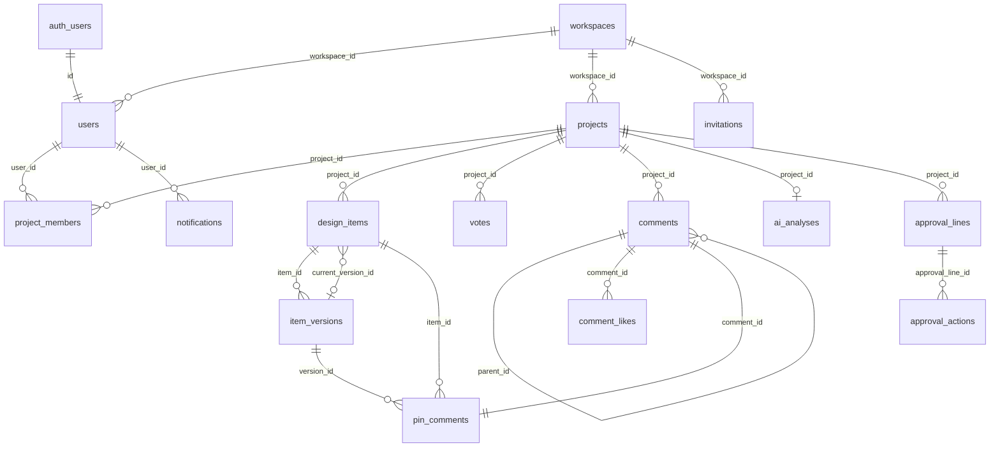

# ApprovalOS DB 명세서

- 작성일: 2026-07-20
- 최종 갱신: 2026-07-21
- 기준: `supabase/migrations/001`–`019`, `src/types/index.ts`
- DBMS: PostgreSQL (Supabase)
- 데모 런타임: 동일 도메인을 `localStorage`(`approvalos_db_v1`) + IndexedDB(`approvalos_files`)로 미러링

> **2026-07-21:** `019`로 `projects.start_date`, `comments.image_urls`, `notification_prefs` 8종 기본값을 반영. 프로젝트 태그는 서버 컬럼 없이 데모 `localStorage`만 사용.

---

## 1. ER 개요



---

## 2. ENUM 정의 (`001_create_enums.sql`)

| 타입명 | 값 | 설명 |
|--------|-----|------|
| `project_status` | `draft`, `active`, `voting`, `approval`, `closed` | 프로젝트 상태 |
| `vote_type` | `single`, `rank`, `score`, `combined` | 투표 방식 |
| `user_role` | `admin`, `reviewer`, `approver`, `viewer` | 역할 |
| `approval_type` | `all`, `majority` | 단계 통과 조건 (전원 / 과반) |
| `approval_action` | `approved`, `rejected` | 승인 행위 |
| `comment_type` | `general`, `pin` | 댓글 종류 |
| `notification_type` | `deadline_soon`, `new_comment`, `new_pin`, `result_open`, `analysis_done`, `approval_requested`, `approval_done`, `rejected` | 알림 종류 |
| `plan_type` | `free`, `pro`, `enterprise` | 워크스페이스 플랜 |
| `visibility_type` | `internal`, `link` | 프로젝트 공개 범위 |
| `approval_line_status` | `pending`, `active`, `completed`, `rejected` | 승인 단계 상태 |

---

## 3. 테이블 명세

### 3.1 `workspaces` — 워크스페이스

| 컬럼 | 타입 | NULL | 기본값 | 설명 |
|------|------|------|--------|------|
| id | UUID | N | `gen_random_uuid()` | PK |
| name | TEXT | N | | 이름 |
| logo_url | TEXT | Y | | 로고 URL |
| plan | plan_type | N | `free` | 요금제 |
| invite_token | TEXT | N | random hex | 워크스페이스 초대 토큰 (UNIQUE) |
| created_at | TIMESTAMPTZ | N | `now()` | |
| updated_at | TIMESTAMPTZ | N | `now()` | |

---

### 3.2 `users` — 프로필 (Auth 연동)

| 컬럼 | 타입 | NULL | 기본값 | 설명 |
|------|------|------|--------|------|
| id | UUID | N | | PK, `auth.users(id)` FK, CASCADE |
| email | TEXT | N | | UNIQUE |
| name | TEXT | N | | 표시 이름 |
| avatar_url | TEXT | Y | | |
| company | TEXT | Y | | |
| title | TEXT | Y | | 직책 |
| workspace_id | UUID | Y | | → workspaces, SET NULL |
| role | user_role | N | `reviewer` | WS 기본 역할 |
| notification_prefs | JSONB | N | 아래 참고 | 알림 수신 설정 (8종) |
| created_at | TIMESTAMPTZ | N | `now()` | |
| updated_at | TIMESTAMPTZ | N | `now()` | |

**인덱스:** `idx_users_workspace (workspace_id)`

**notification_prefs 기본값** (`019`에서 8종으로 갱신)

```json
{
  "deadline_soon": true,
  "new_comment": true,
  "new_pin": false,
  "result_open": true,
  "analysis_done": true,
  "approval_requested": true,
  "approval_done": true,
  "rejected": true
}
```

> 앱은 `DEFAULT_NOTIFICATION_PREFS`와 병합해 구버전 prefs(5종)도 안전하게 동작한다.

---

### 3.3 `projects` — 프로젝트

| 컬럼 | 타입 | NULL | 기본값 | 설명 |
|------|------|------|--------|------|
| id | UUID | N | `gen_random_uuid()` | PK |
| workspace_id | UUID | N | | → workspaces CASCADE |
| title | TEXT | N | | |
| description | TEXT | Y | | |
| status | project_status | N | `draft` | |
| vote_type | vote_type | N | `combined` | |
| start_date | TIMESTAMPTZ | Y | | 진행 시작일 (`019`). NULL이면 UI에서 `created_at` 대체 |
| deadline | TIMESTAMPTZ | N | | 투표/진행 마감(종료)일 |
| visibility | visibility_type | N | `internal` | |
| public_token | TEXT | Y | | 공개 투표 토큰 UNIQUE |
| use_approval | BOOLEAN | N | `false` | 다단계 승인 사용 |
| created_by | UUID | N | | → users |
| created_at | TIMESTAMPTZ | N | `now()` | |
| updated_at | TIMESTAMPTZ | N | `now()` | |

**인덱스:** `idx_projects_workspace`, `idx_projects_public_token`

> **프로젝트 태그**는 서버 컬럼이 없다. 데모 UI만 `localStorage`(`approvalos_project_tags_{projectId}`)에 저장한다.

---

### 3.4 `project_members` — 프로젝트 멤버

| 컬럼 | 타입 | NULL | 기본값 | 설명 |
|------|------|------|--------|------|
| id | UUID | N | `gen_random_uuid()` | PK |
| project_id | UUID | N | | → projects CASCADE |
| user_id | UUID | N | | → users CASCADE |
| role | user_role | N | `reviewer` | 프로젝트 역할 |
| created_at | TIMESTAMPTZ | N | `now()` | |

**제약:** `UNIQUE(project_id, user_id)`

---

### 3.5 `design_items` — 시안

| 컬럼 | 타입 | NULL | 기본값 | 설명 |
|------|------|------|--------|------|
| id | UUID | N | `gen_random_uuid()` | PK |
| project_id | UUID | N | | → projects CASCADE |
| title | TEXT | N | | 시안명 |
| keywords | TEXT[] | N | `{}` | 키워드 |
| description | TEXT | Y | | |
| sort_order | INT | N | `0` | 정렬 |
| current_version_id | UUID | Y | | → item_versions SET NULL (006에서 FK 추가) |
| created_by | UUID | N | | → users |
| created_at | TIMESTAMPTZ | N | `now()` | |
| updated_at | TIMESTAMPTZ | N | `now()` | |

**인덱스:** `idx_design_items_project`

---

### 3.6 `item_versions` — 시안 버전

| 컬럼 | 타입 | NULL | 기본값 | 설명 |
|------|------|------|--------|------|
| id | UUID | N | `gen_random_uuid()` | PK |
| item_id | UUID | N | | → design_items CASCADE |
| version_number | INT | N | | 버전 번호 |
| file_url | TEXT | N | | Storage URL (데모: `idb:…`) |
| thumbnail_url | TEXT | Y | | |
| change_note | TEXT | Y | | 변경 메모 |
| created_by | UUID | N | | → users |
| created_at | TIMESTAMPTZ | N | `now()` | |

**제약:** `UNIQUE(item_id, version_number)`

---

### 3.7 `votes` — 투표

| 컬럼 | 타입 | NULL | 기본값 | 설명 |
|------|------|------|--------|------|
| id | UUID | N | `gen_random_uuid()` | PK |
| project_id | UUID | N | | → projects CASCADE |
| user_id | UUID | Y | | → users SET NULL (공개 투표 시 null) |
| guest_name | TEXT | Y | | 게스트 이름 |
| selected_item_ids | UUID[] | N | `{}` | 선택 시안 |
| rankings | UUID[] | N | `{}` | 순위 (앞이 1위) |
| scores | JSONB | N | `{}` | `{ itemId: { 기준: 1~5 } }` |
| comment | TEXT | Y | | 의견 |
| created_at | TIMESTAMPTZ | N | `now()` | |
| updated_at | TIMESTAMPTZ | N | `now()` | |

**인덱스:** `idx_votes_project`

**scores 예시**

```json
{
  "item-uuid": {
    "브랜드 스토리": 4,
    "신뢰감": 5,
    "각인 효과": 3
  }
}
```

---

### 3.8 `comments` — 댓글

| 컬럼 | 타입 | NULL | 기본값 | 설명 |
|------|------|------|--------|------|
| id | UUID | N | `gen_random_uuid()` | PK |
| project_id | UUID | N | | → projects CASCADE |
| user_id | UUID | N | | → users CASCADE |
| content | TEXT | N | | 본문. 이미지 전용 댓글은 `''` 허용 |
| type | comment_type | N | `general` | general / pin |
| item_ids | UUID[] | N | `{}` | 태그된 시안 |
| parent_id | UUID | Y | | 대댓글 → comments CASCADE |
| like_count | INT | N | `0` | 캐시 카운트 |
| image_urls | TEXT[] | N | `{}` | 첨부 이미지 URL (`019`). 데모는 `idb:…`, 권장 최대 4장 |
| created_at | TIMESTAMPTZ | N | `now()` | |
| updated_at | TIMESTAMPTZ | N | `now()` | |

**인덱스:** `idx_comments_project`

---

### 3.9 `pin_comments` — 핀 댓글

| 컬럼 | 타입 | NULL | 기본값 | 설명 |
|------|------|------|--------|------|
| id | UUID | N | `gen_random_uuid()` | PK |
| item_id | UUID | N | | → design_items CASCADE |
| version_id | UUID | N | | → item_versions CASCADE |
| comment_id | UUID | N | | → comments CASCADE |
| pin_x | DOUBLE PRECISION | N | | 0~1 정규화 X |
| pin_y | DOUBLE PRECISION | N | | 0~1 정규화 Y |
| pin_number | INT | N | | 핀 번호 |
| is_resolved | BOOLEAN | N | `false` | 해결 여부 |
| page_number | INT | Y | | PDF 페이지 (미사용 시 null) |
| created_at | TIMESTAMPTZ | N | `now()` | |

**제약:** `pin_x`, `pin_y` ∈ [0, 1]  
**인덱스:** `idx_pin_comments_item`

---

### 3.10 `comment_likes` — 댓글 좋아요

| 컬럼 | 타입 | NULL | 기본값 | 설명 |
|------|------|------|--------|------|
| id | UUID | N | `gen_random_uuid()` | PK |
| comment_id | UUID | N | | → comments CASCADE |
| user_id | UUID | N | | → users CASCADE |
| created_at | TIMESTAMPTZ | N | `now()` | |

**제약:** `UNIQUE(comment_id, user_id)`

---

### 3.11 `ai_analyses` — AI 분석 (프로젝트당 1건)

| 컬럼 | 타입 | NULL | 기본값 | 설명 |
|------|------|------|--------|------|
| id | UUID | N | `gen_random_uuid()` | PK |
| project_id | UUID | N | | → projects CASCADE, UNIQUE |
| keywords | JSONB | N | `[]` | `[{ word, count, sentiment }]` |
| item_summaries | JSONB | N | `{}` | `{ itemId: summary }` |
| overall_summary | TEXT | N | `''` | 종합 요약 |
| sentiment | JSONB | N | `{positive,neutral,negative}` | 비율 % |
| brand_fit_scores | JSONB | N | `{}` | `{ itemId: 0~100 }` |
| created_at | TIMESTAMPTZ | N | `now()` | |

---

### 3.12 `approval_lines` — 승인 단계

| 컬럼 | 타입 | NULL | 기본값 | 설명 |
|------|------|------|--------|------|
| id | UUID | N | `gen_random_uuid()` | PK |
| project_id | UUID | N | | → projects CASCADE |
| step_order | INT | N | | 단계 순번 |
| step_name | TEXT | N | | 단계명 |
| approver_ids | UUID[] | N | `{}` | 승인자 user id 목록 |
| approval_type | approval_type | N | `all` | 전원 / 과반 |
| status | approval_line_status | N | `pending` | |
| deadline | TIMESTAMPTZ | Y | | 단계 마감 |
| created_at | TIMESTAMPTZ | N | `now()` | |

**제약:** `UNIQUE(project_id, step_order)`  
**인덱스:** `idx_approval_lines_project`

---

### 3.13 `approval_actions` — 승인/반려 액션

| 컬럼 | 타입 | NULL | 기본값 | 설명 |
|------|------|------|--------|------|
| id | UUID | N | `gen_random_uuid()` | PK |
| approval_line_id | UUID | N | | → approval_lines CASCADE |
| user_id | UUID | N | | → users CASCADE |
| action | approval_action | N | | approved / rejected |
| selected_item_id | UUID | Y | | 최종 시안 → design_items SET NULL |
| reject_reason | TEXT | Y | | 반려 사유 |
| created_at | TIMESTAMPTZ | N | `now()` | |

**제약:** `UNIQUE(approval_line_id, user_id)` — 단계당 1인 1액션

---

### 3.14 `invitations` — 초대

| 컬럼 | 타입 | NULL | 기본값 | 설명 |
|------|------|------|--------|------|
| id | UUID | N | `gen_random_uuid()` | PK |
| project_id | UUID | Y | | → projects CASCADE (프로젝트 초대) |
| workspace_id | UUID | N | | → workspaces CASCADE |
| email | TEXT | N | | 초대 대상 |
| role | user_role | N | `reviewer` | |
| token | TEXT | N | | 수락 토큰 UNIQUE |
| invited_by | UUID | N | | → users |
| expires_at | TIMESTAMPTZ | N | | |
| accepted_at | TIMESTAMPTZ | Y | | 수락 시각 |
| created_at | TIMESTAMPTZ | N | `now()` | |

**인덱스:** `idx_invitations_token`

> `workspaces.invite_token`과 별개. 이메일 초대는 본 테이블, WS 링크 초대는 workspace 토큰.

---

### 3.15 `notifications` — 알림

| 컬럼 | 타입 | NULL | 기본값 | 설명 |
|------|------|------|--------|------|
| id | UUID | N | `gen_random_uuid()` | PK |
| user_id | UUID | N | | → users CASCADE |
| type | notification_type | N | | |
| title | TEXT | N | | |
| body | TEXT | N | `''` | |
| link | TEXT | Y | | 앱 내 경로 |
| is_read | BOOLEAN | N | `false` | |
| created_at | TIMESTAMPTZ | N | `now()` | |

**인덱스:** `idx_notifications_user (user_id, is_read)`

---

## 4. Storage

| 항목 | 값 |
|------|-----|
| 버킷 | `designs` (`017_storage_policies.sql`) |
| public | `true` |
| INSERT/UPDATE/DELETE | `authenticated` |
| SELECT | 전원 (버킷 public) |

| 용도 | 저장 위치 |
|------|-----------|
| 시안 파일 | `item_versions.file_url` / `thumbnail_url` |
| 댓글 첨부 이미지 | `comments.image_urls[]` (동일 버킷 또는 데모 IndexedDB) |

데모: 시안·댓글 이미지 모두 IndexedDB `approvalos_files`에 두고 URL은 `idb:{uuid}` 형식.

---

## 5. RLS 현황 (`016_rls_policies.sql`)

| 테이블 | RLS | 정책 유무 |
|--------|-----|-----------|
| users | ON | SELECT/UPDATE 있음 |
| workspaces | ON | SELECT/UPDATE(admin) 있음 |
| projects | ON | workspace ALL + 공개 link SELECT |
| design_items | ON | workspace ALL |
| notifications | ON | 본인 ALL |
| project_members | ON | **정책 없음** |
| item_versions | ON | **정책 없음** |
| votes | ON | **정책 없음** |
| comments | ON | **정책 없음** |
| pin_comments | ON | **정책 없음** |
| comment_likes | ON | **정책 없음** |
| ai_analyses | ON | **정책 없음** |
| approval_lines | ON | **정책 없음** |
| approval_actions | ON | **정책 없음** |
| invitations | ON | **정책 없음** |

> 정책이 없는 테이블은 RLS ON 시 접근이 막힐 수 있음. 프로덕션 적용 전 정책 보강 필요.

---

## 6. Cron (`018_cron_jobs.sql`)

현재 **전부 주석**. 설계 의도:

| Job | 주기 | 동작 |
|-----|------|------|
| close-expired-projects | 매시 | `deadline` 지난 active/voting → closed |
| check-approval-timeout | 매일 09:00 | Edge `check-approval-timeout` 호출 |

---

## 7. 데모 DB와의 대응

| Supabase | 데모 |
|----------|------|
| PostgreSQL 테이블 | `LocalDB` 배열 (`src/lib/localDb.ts`) |
| Storage `designs` | IndexedDB `approvalos_files` (`idb:{uuid}`) |
| `auth.users` | 로컬 `users` (비밀번호 미검증) |
| Edge Functions | mock / toast 스텁 |
| `projects.start_date` | `Project.start_date` (생성 시 `created_at` 기본) |
| `comments.image_urls` | `Comment.image_urls` + `fileStore.putFile` |

---

## 8. 마이그레이션 적용 순서

```
001 enums
002 workspaces
003 users
004 projects + project_members
005 design_items
006 item_versions (+ current_version FK)
007 votes
008 comments
009 pin_comments
010 comment_likes
011 ai_analyses
012 approval_lines
013 approval_actions
014 invitations
015 notifications
016 RLS
017 Storage
018 Cron (주석)
019 project start_date + comment image_urls + prefs 8종 기본값
```

---

## 9. 변경 이력

| 일자 | 마이그레이션 | 내용 |
|------|--------------|------|
| 2026-07-20 | 001–018 | 초기 스키마 스냅샷 |
| 2026-07-21 | 019 | `projects.start_date`, `comments.image_urls`, `notification_prefs` 8종 기본값 |

---

## 10. 관련 파일

| 경로 | 역할 |
|------|------|
| `supabase/migrations/*.sql` | 스키마 원본 |
| `src/types/index.ts` | 프론트 타입 |
| `src/lib/localDb.ts` | 데모 CRUD |
| `src/lib/fileStore.ts` | 데모 파일 저장 |

스키마 변경 시 본 문서와 SQL을 함께 갱신하세요.
