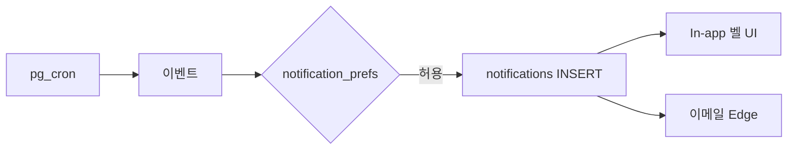
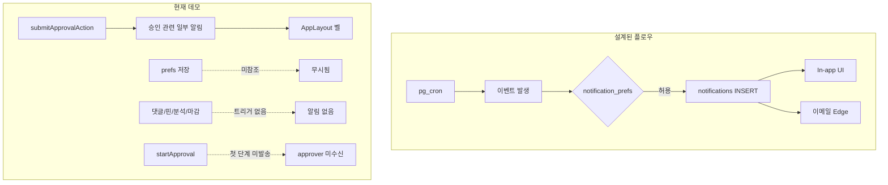

# ApprovalOS 알림 현황

- 작성일: 2026-07-20
- 기준: `supabase/migrations/001`–`018`, `src/lib/localDb.ts`, `src/stores/notificationStore.ts`, `src/components/layout/AppLayout.tsx`
- 현재 모드: **로컬 데모** (localStorage + IndexedDB). Supabase는 스키마·Edge 초안만 존재, 프론트 미연결
- 관련 문서: [DB 명세서](./2026-07-20-DB명세서.md), [작업 점검표](./2026-07-20-작업점검표.md), **[보완 기획·개발 계획 v1.1](./2026-07-21-알림멤버초대-보완계획.md)**

---

## 1. 요약

| 영역 | 완성도 | 비고 |
|------|--------|------|
| DB·ENUM·RLS 설계 | **높음** | `notifications` 테이블, 8종 타입, 본인 ALL 정책 |
| In-app UI (벨·설정) | **높음** | 드롭다운·읽음·Account 8종 토글·즉시 갱신 |
| 이벤트 → 알림 트리거 | **높음 (데모)** | 승인·댓글·핀·분석·마감 연결 (`deadline_soon` 제외) |
| `notification_prefs` 반영 | **높음** | `shouldNotify` / `pushNotification` |
| 이메일·Cron·Realtime | **설계/스텁만** | Edge·pg_cron placeholder — Out of Scope |

**한 줄 요약:** 로컬 데모 기준 **Phase A 구현 완료** ([보완계획](./2026-07-21-알림멤버초대-보완계획.md)). `deadline_soon`·이메일·Realtime은 다음 라운드.

---

## 2. 설계 (DB·모델·채널)

### 2.1 `notifications` 테이블

| 컬럼 | 타입 | NULL | 기본값 | 설명 |
|------|------|------|--------|------|
| id | UUID | N | `gen_random_uuid()` | PK |
| user_id | UUID | N | | → users CASCADE |
| type | notification_type | N | | 알림 종류 |
| title | TEXT | N | | 제목 |
| body | TEXT | N | `''` | 본문 |
| link | TEXT | Y | | 앱 내 경로 (예: `/projects/{id}/approval`) |
| is_read | BOOLEAN | N | `false` | 읽음 여부 |
| created_at | TIMESTAMPTZ | N | `now()` | |

**인덱스:** `idx_notifications_user (user_id, is_read)`

근거: `015_create_notifications.sql`, DB명세서 §3.15

### 2.2 알림 종류 (`notification_type` ENUM)

```sql
-- 001_create_enums.sql
CREATE TYPE notification_type AS ENUM (
  'deadline_soon', 'new_comment', 'new_pin', 'result_open',
  'analysis_done', 'approval_requested', 'approval_done', 'rejected'
);
```

| 타입 | 설계 의도 |
|------|-----------|
| `deadline_soon` | 투표/프로젝트 마감 임박 |
| `new_comment` | 새 일반 댓글 |
| `new_pin` | 새 핀 댓글 |
| `result_open` | 결과(투표·승인) 공개 |
| `analysis_done` | AI 분석 완료 |
| `approval_requested` | 승인 요청 도착 |
| `approval_done` | 최종 승인 완료 |
| `rejected` | 승인 반려 |

### 2.3 사용자 알림 설정 (`users.notification_prefs`)

JSONB 컬럼. DB·타입 기본값:

```json
{
  "deadline_soon": true,
  "new_comment": true,
  "new_pin": false,
  "approval_requested": true,
  "rejected": true
}
```

근거: `003_create_users.sql`, `src/types/index.ts` — `NotificationPrefs`, `DEFAULT_NOTIFICATION_PREFS`

> **불일치:** ENUM에는 `result_open`, `analysis_done`, `approval_done`이 있으나 `notification_prefs`에는 해당 키가 없다.

### 2.4 RLS

| 테이블 | RLS | 정책 |
|--------|-----|------|
| notifications | ON | `notifications_own` — `user_id = auth.uid()` 본인 ALL |

멤버·초대 관련 테이블과 달리 **정책이 정의되어 있음**. (DB명세서 §5)

### 2.5 배치·Edge (스텁)

| 항목 | 파일 | 내용 |
|------|------|------|
| 마감 프로젝트 자동 close | `018_cron_jobs.sql` | pg_cron 스케줄 **주석 placeholder** |
| 승인 타임아웃 체크 | `018_cron_jobs.sql` | Edge HTTP 호출 **주석 placeholder** |
| 승인 타임아웃 Edge | `check-approval-timeout/index.ts` | 타임아웃 라인 조회 후 `console.log`만 |

### 2.6 설계된 채널 (의도)



현재 데모는 **In-app만** 일부 구현. 이메일·Cron·Realtime은 미연동.

---

## 3. 데모(로컬) 구현 현황

### 3.1 In-app UI

| 구성 | 파일 | 기능 |
|------|------|------|
| 알림 벨 + 미읽음 배지 | `AppLayout.tsx` | 헤더 우측, 미읽음 수 표시 |
| 알림 드롭다운 | `AppLayout.tsx` | 최대 20건, 제목·본문, 클릭 시 `link` 이동 |
| 모두 읽음 | `AppLayout.tsx` + `notificationStore.ts` | `markAllRead(userId)` |
| 알림 설정 | `Account.tsx` | 5종 on/off 체크박스 |

### 3.2 Zustand 스토어

`src/stores/notificationStore.ts`

| 메서드 | 설명 |
|--------|------|
| `load(userId)` | `localApi.getNotifications` 로드 |
| `markRead(id)` | 개별 읽음 |
| `markAllRead(userId)` | 전체 읽음 |
| `unreadCount()` | 미읽음 수 |

로그인 사용자 기준, `AppLayout` 마운트 시 `load(user.id)` 호출. **실시간 갱신·폴링 없음**.

### 3.3 localApi

| API | 상태 | 설명 |
|-----|------|------|
| `getNotifications(userId)` | ✅ | user_id 필터, 최신순 |
| `markNotificationRead(id)` | ✅ | |
| `markAllNotificationsRead(userId)` | ✅ | |
| `updateNotificationPrefs(userId, prefs)` | ✅ | `updateUser` 래퍼 |
| `createNotification` (공개 API) | ❌ | 내부 `notifyAdmins`·직접 push만 |

### 3.4 실제 알림 발송 (승인 흐름만)

`localDb.ts` — `submitApprovalAction` 내부 및 `notifyAdmins` 헬퍼:

| 이벤트 | 타입 | 수신자 | 트리거 위치 |
|--------|------|--------|-------------|
| 다음 승인 단계 활성화 | `approval_requested` | 해당 단계 `approver_ids` | `submitApprovalAction` — 이전 단계 통과 시 |
| 승인 반려 | `rejected` | WS `admin` | `notifyAdmins` |
| 최종 승인 완료 | `approval_done` | WS `admin` | `notifyAdmins` |

`notifyAdmins` 구현:

```914:936:c:\Dev\ApprovalOS\src\lib\localDb.ts
function notifyAdmins(
  db: LocalDB,
  projectId: string,
  type: Notification['type'],
  title: string,
  body: string
): void {
  const project = db.projects.find((p) => p.id === projectId)
  if (!project) return
  const admins = db.users.filter((u) => u.workspace_id === project.workspace_id && u.role === 'admin')
  for (const admin of admins) {
    db.notifications.push({ ... })
  }
}
```

---

## 4. 타입별 트리거 현황

| 타입 | 설계 | 데모 구현 | 비고 |
|------|------|-----------|------|
| `approval_requested` | ✅ | ⚠️ 부분 | **다음 단계**만. `startApproval()` 첫 단계 approver에게 **미발송** |
| `rejected` | ✅ | ✅ | admin에게만 |
| `approval_done` | ✅ | ✅ | admin에게만 |
| `deadline_soon` | ✅ | ❌ | Cron·로컬 스케줄 없음 |
| `new_comment` | ✅ | ❌ | `createComment`에 알림 없음 |
| `new_pin` | ✅ | ❌ | `createPin`에 알림 없음 |
| `result_open` | ✅ | ❌ | 프로젝트 마감·결과 공개 시 트리거 없음 |
| `analysis_done` | ✅ | ❌ | `saveAnalysis`에 알림 없음 |

### 관련 API와 알림 연동 여부

| API / 함수 | 알림 생성 |
|------------|-----------|
| `startApproval` | ❌ (첫 단계 `approval_requested` 없음) |
| `submitApprovalAction` | ✅ (일부) |
| `createComment` | ❌ |
| `createPin` | ❌ |
| `saveAnalysis` | ❌ |
| `upsertVote` | ❌ |
| `updateProject` (status → closed 등) | ❌ |

---

## 5. 누락·미완성 (갭 목록)

### 5.1 설정(pref) 미적용

| # | 갭 | 설명 |
|---|-----|------|
| 1 | **prefs 미참조** | `notification_prefs`는 `Account`에서 저장되나, 알림 생성 시 **체크하지 않음** |
| 2 | **prefs 키 불일치** | ENUM 8종 vs prefs 5종 — `result_open`, `analysis_done`, `approval_done` 설정 UI 없음 |
| 3 | **Account UI 5종만** | `deadline_soon`, `new_comment`, `new_pin`, `approval_requested`, `rejected` |

### 5.2 수신 대상·채널

| # | 갭 | 설명 |
|---|-----|------|
| 4 | **수신자 단순** | 승인 완료/반려는 WS admin만. 프로젝트 멤버·작성자·approver(비-admin) 미고려 |
| 5 | **이메일/푸시 없음** | in-app만. 작업점검표 §1-C #16 "실 이메일 초대/승인 알림" 미결정 |
| 6 | **실시간 없음** | Supabase Realtime·폴링 없음. 페이지 진입 시 `load()`만 |
| 7 | **알림 생성 후 스토어 미갱신** | 다른 탭/사용자 액션으로 생성된 알림은 새로고침·재진입 전까지 벨에 안 보일 수 있음 |

### 5.3 Supabase / 프로덕션

| # | 갭 | 설명 |
|---|-----|------|
| 8 | **프론트 Supabase 미연결** | 알림도 전부 localStorage |
| 9 | **Cron 미적용** | 마감 임박·승인 타임아웃 알림 미동작 |
| 10 | **Edge 스텁** | `check-approval-timeout` — DB INSERT·메일 없음 |
| 11 | **이메일 Edge 없음** | `send-invitation`만 존재. 알림 전용 발송 함수 없음 |

### 5.4 설계 vs 프론트 불일치

| 설계 | 프론트 현실 |
|------|-------------|
| 8종 `notification_type` | 3종만 부분 발송 |
| `notification_prefs` 5키 + ENUM 3키 미매핑 | prefs 저장만, 발송 시 무시 |
| Cron 마감·타임아웃 | 주석·console.log |
| 이메일 채널 (기획) | 미구현 |

---

## 6. 플로우 다이어그램 (설계 vs 현실)



---

## 7. 관련 파일 경로

### 문서
- `docs/2026-07-20-DB명세서.md` — §3.2 `notification_prefs`, §3.15 notifications, §5 RLS
- `docs/2026-07-20-작업점검표.md` — §1-C #16 (이메일 알림 결정)

### Supabase 마이그레이션
- `supabase/migrations/001_create_enums.sql` — `notification_type`
- `supabase/migrations/003_create_users.sql` — `notification_prefs` 기본값
- `supabase/migrations/015_create_notifications.sql`
- `supabase/migrations/016_rls_policies.sql` — `notifications_own`
- `supabase/migrations/018_cron_jobs.sql` — placeholder

### 로컬/타입/스토어
- `src/lib/localDb.ts` — 알림 CRUD, `notifyAdmins`, 승인 시 push
- `src/types/index.ts` — `Notification`, `NotificationType`, `NotificationPrefs`
- `src/stores/notificationStore.ts`

### 프론트 UI
- `src/components/layout/AppLayout.tsx` — 알림 벨·드롭다운
- `src/pages/Account.tsx` — 알림 설정 토글

### Edge
- `supabase/functions/check-approval-timeout/index.ts` — 스텁

---

## 8. 권장 보완 순서

> **구현 SSOT:** [2026-07-21-알림멤버초대-보완계획.md](./2026-07-21-알림멤버초대-보완계획.md) Phase A  
> 아래는 As-Is 요약. 상세 작업 ID·수정 사항·Out of Scope는 보완계획을 따른다.

| 우선순위 | 작업 | 보완계획 |
|----------|------|----------|
| 1 | `NotificationPrefs` 8종 + Account UI | A1–A2 |
| 2 | `shouldNotify` / `pushNotification` / `notifyAdmins` | A3 |
| 3 | `startApproval` 1단계 `approval_requested` | A4 |
| 4 | `createComment` / `createPin` / `saveAnalysis` | A5–A7 |
| 5 | `closeProjectAndNotify` (`updateProject` + 승인완료 공용) | A8 |
| 6 | 기존 승인 알림 prefs·link 통일 | A9 |
| 7 | `notificationStore.load` 즉시 갱신 | A10 |
| — | `deadline_soon` / 이메일 / Realtime | **다음 라운드** (Out of Scope) |

**주의 (v1.0 원안 대비):** 승인 완료 시 `status=closed`가 `updateProject`를 거치지 않음 → 마감 알림은 공용 헬퍼 필수. approver link는 `/projects/:id/approval/review`.

---

## 9. 작업점검표 연동

| 구분 | # | 내용 |
|------|---|------|
| B. 구현 | 18 | 알림 이벤트 트리거·prefs — [보완계획](./2026-07-21-알림멤버초대-보완계획.md) Phase A |
| C. 제품 결정 | 16 | 실 이메일 알림 — 이번 라운드 Out of Scope |

---

## 10. 멤버·초대와의 관계

- 초대 수락·멤버 추가 시 **환영/참여 알림** — 이번 라운드 Out of Scope ([보완계획](./2026-07-21-알림멤버초대-보완계획.md) §2.2)
- 승인 알림 수신자가 WS `admin` 위주 — `project_members`·`users.role` 이중 구조와 동일한 갭
- 이메일 채널은 초대(`send-invitation`)와 알림이 **분리**되어 있으며 둘 다 스텁 수준
- 초대 E2E 구현은 보완계획 **Phase B**와 함께 진행
