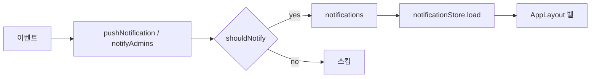

# ApprovalOS — 알림·멤버초대 보완 기획 및 개발 계획

- 작성일: 2026-07-21
- 버전: **v1.1** (원안 v1.0 검토·수정 반영)
- 원안: `approvalos_cursor_fix_notification_invite.md` (2026-07-20)
- 근거 현황: [알림-현황](./2026-07-20-알림-현황.md), [멤버초대-현황](./2026-07-20-멤버초대-현황.md)
- 런타임 범위: **로컬 데모** (`localStorage` + IndexedDB). Supabase 연동·이메일·Cron은 **이번 라운드 제외**

---

## 1. 목표

로컬 데모에서 아래를 **실제로 동작**하게 한다.

1. **알림:** 설계된 8종 중 데모에 필요한 이벤트가 in-app 벨로 도착하고, 계정 설정의 `notification_prefs`가 발송에 반영된다.
2. **멤버·초대:** WS 링크 초대와 이메일 초대(`invitations`)가 가입/로그인과 이어져, 새 사용자가 워크스페이스(및 프로젝트)에 소속될 수 있다.

**성공 기준 (Acceptance)**

| # | 시나리오 | 기대 결과 |
|---|----------|-----------|
| A | 승인 시작 | 1단계 approver 벨에 `approval_requested` |
| B | 댓글/핀/분석 | admin(본인 제외)에게 해당 타입 알림, prefs off면 미발송 |
| C | 프로젝트 마감(수동·승인완료) | `project_members`에 `result_open` |
| D | WS 초대 링크 `/invite/{workspace.invite_token}` | 가입/로그인 후 WS 소속 |
| E | 이메일 초대 `/invite/{invitation.token}` | 이메일 일치 시에만 수락, 프로젝트 멤버 추가 |
| F | Signup `?invite=` | 가입 직후 초대 반영 |
| G | ProjectNew 초대 생성 | 관리자가 초대 URL 복사 가능 |
| H | 대기 초대·멤버 삭제 | 목록/취소, 삭제 시 `project_members`·pending 초대 정리 |

---

## 2. 이번 라운드 범위

### 2.1 In Scope (구현)

| Phase | 내용 |
|-------|------|
| **A. 알림** | prefs 8종, 공통 push 헬퍼, 트리거 연결, 마감 공용 헬퍼, 벨 즉시 갱신 |
| **B. 멤버초대** | WS 토큰 수락, `?invite=` 연동, 초대 URL UI, 이메일 검증, 대기 초대, 멤버 삭제 정리 |
| **C. 문서·검증** | 현황 문서 체크 갱신, `npm run build`, 수동 스모크 |

### 2.2 Out of Scope (다음 라운드)

| 항목 | 이유 |
|------|------|
| `deadline_soon` + pg_cron | Cron/스케줄 인프라 필요 |
| 이메일 Edge (`send-invitation`) | 제공자 키·제품 결정(작업점검표 #16) 필요 |
| `ProjectSettings` 프로젝트 멤버 CRUD | 초대 E2E와 분리 가능, 별도 스프린트 |
| `project_members` 기반 접근 제어 | 권한 모델 재설계 필요 |
| Supabase Auth/RLS 실연동 | 백엔드 전환 작업(#14) |
| Realtime/폴링 고도화 | 데모는 mutation 후 `load()`로 충분 |

---

## 3. 원안(v1.0) 대비 수정 사항

구현 시 아래를 **반드시** 따른다. 원안 스니펫을 그대로 복사하지 말 것.

| # | 원안 문제 | v1.1 수정 |
|---|-----------|-----------|
| 1 | `inv.accepted` / `i.accepted = true` | 필드명은 **`accepted_at: string \| null`**. 취소용으로 수락 시각을 넣지 말 것 → **레코드 삭제** 또는 `expires_at = now()` |
| 2 | `result_open`을 `updateProject`만 훅 | 승인 완료 시 `submitApprovalAction`이 **직접** `status = 'closed'`. → **`closeProjectAndNotify` 공용 헬퍼** |
| 3 | Signup 후 무조건 `acceptInvitation` | WS 토큰은 invitations에 없음. → **`acceptInviteToken(token, userId)`** 로 분기 |
| 4 | prefs보다 트리거를 먼저 | **`NotificationPrefs` 8종 + `shouldNotify`를 먼저** (A1 → A0) |
| 5 | 알림 link가 `/approval`과 `/approval/review` 혼재 | approver 대상은 **`/projects/:id/approval/review`** 로 통일 |
| 6 | `crypto.randomUUID()` 직접 사용 | 기존 **`uid()` / `now()`** 사용 |
| 7 | (누락) 자기 자신 알림 | `notifyAdmins(..., actorId?)`에서 **actor 제외** |
| 8 | (누락) ProjectNew 즉시 navigate | 생성 후 **모달/완료 스텝**에서 링크 표시 후 이동, 또는 Settings로 안내 |
| 9 | 이메일 검증을 전 경로에 적용 | **이메일 초대만** 검증. WS 링크는 이메일 없음 |
| 10 | Windows에서 TSX 한글 직접 편집 | Account 라벨 등은 **깨짐 주의** → 라벨 맵/`scripts` 또는 검증 필수 |

---

## 4. 데이터·API 설계 (로컬)

### 4.1 알림 공통 헬퍼 (`localDb.ts`)

```
shouldNotify(user, type) → boolean
  - prefs[type] === false 이면 false
  - prefs에 키 없으면 DEFAULT_NOTIFICATION_PREFS 또는 true

pushNotification(db, { userId, type, title, body, link })
  - shouldNotify 통과 시에만 push
  - id: uid(), created_at: now()

notifyAdmins(db, projectId, type, title, body, link?, actorId?)
  - WS admin 중 actorId 제외, pushNotification 사용

closeProjectAndNotify(db, projectId)
  - status → closed (이미 closed면 no-op)
  - project_members 전원에게 result_open (prefs 반영)
```

### 4.2 NotificationPrefs (8종)

ENUM `notification_type`과 정렬:

| key | Account 라벨 | 기본값 |
|-----|--------------|--------|
| `deadline_soon` | 투표 마감 임박 | true (발송 트리거는 다음 라운드) |
| `new_comment` | 새 댓글 | true |
| `new_pin` | 새 핀 댓글 | false |
| `result_open` | 결과 공개 | true |
| `analysis_done` | AI 분석 완료 | true |
| `approval_requested` | 승인 요청 | true |
| `approval_done` | 최종 승인 완료 | true |
| `rejected` | 반려 발생 | true |

후속(선택): `003_create_users.sql` DEFAULT JSONB·DB명세서 §3.2도 동일 키로 맞춤.

### 4.3 초대 통합 API (`localDb.ts`)

```
getWorkspaceByInviteToken(token) → Workspace | null

joinWorkspaceByInviteToken(token, userId)
  - users.workspace_id, role = reviewer(기본)
  - 이미 다른 WS면 정책: 에러 또는 덮어쓰기 → **에러(이미 소속됨)** 권장

acceptInvitation(token, userId)
  - accepted_at / expires_at 검사
  - email 일치 검사 (초대 이메일 vs user.email)
  - WS 소속 + role, project_id 있으면 project_members

acceptInviteToken(token, userId)  // 통합 진입점
  - getInvitation 있으면 acceptInvitation
  - else getWorkspaceByInviteToken → joinWorkspaceByInviteToken
  - else throw

getPendingInvitations(workspaceId)
  - !accepted_at && expires_at > now()

cancelInvitation(id)
  - 레코드 삭제 (또는 expires_at = now())

removeWorkspaceMember(userId, workspaceId)
  - workspace_id = null
  - 해당 WS 프로젝트의 project_members 제거
  - 해당 WS의 pending invitations 중 해당 email 삭제(또는 만료)
```

### 4.4 알림 링크 규칙

| 타입 | link |
|------|------|
| `approval_requested` / `approval_done` / `rejected` | `/projects/:id/approval/review` (또는 완료·반려는 `/approval` 목록도 가능 — **요청은 review 통일**) |
| `new_comment` | `/projects/:id/comments` |
| `new_pin` | `/projects/:id/items/:itemId` |
| `analysis_done` | `/projects/:id/analysis` |
| `result_open` | `/projects/:id` |

---

## 5. 개발 구현 계획

### Phase A — 알림 (우선)

| ID | 작업 | 파일 | 완료 조건 |
|----|------|------|-----------|
| **A1** | `NotificationPrefs` 8종 + DEFAULT | `src/types/index.ts` | 타입 컴파일 |
| **A2** | Account 알림 토글 3종 추가 | `src/pages/Account.tsx` | UI 8개 토글 |
| **A3** | `shouldNotify` / `pushNotification` / `notifyAdmins` 리팩터 | `src/lib/localDb.ts` | prefs·link·actor 제외 |
| **A4** | `startApproval` → 1단계 `approval_requested` | `localDb.ts` | 승인 시작 시 벨 |
| **A5** | `createComment` → `new_comment` | `localDb.ts` | |
| **A6** | `createPin` → `new_pin` | `localDb.ts` | |
| **A7** | `saveAnalysis` → `analysis_done` | `localDb.ts` | |
| **A8** | `closeProjectAndNotify` + `updateProject` / 승인완료 경로 | `localDb.ts` | 양쪽에서 result_open |
| **A9** | 기존 승인 알림 prefs·link 통일 | `submitApprovalAction` | |
| **A10** | mutation 후 `notificationStore.load(userId)` | 호출 페이지·스토어 | 벨 즉시 반영 |

**구현 순서:** A1 → A2 → A3 → A4~A9 → A10

**예상 공수:** 0.5~1일

### Phase B — 멤버·초대

| ID | 작업 | 파일 | 완료 조건 |
|----|------|------|-----------|
| **B1** | `getWorkspaceByInviteToken` / `joinWorkspaceByInviteToken` | `localDb.ts` | |
| **B2** | `acceptInviteToken` + `acceptInvitation` 이메일·`accepted_at` 검증 | `localDb.ts` | |
| **B3** | `InviteAccept` WS fallback + 통합 수락 | `InviteAccept.tsx` | WS·이메일 링크 모두 OK |
| **B4** | Signup/Login `?invite=` → `acceptInviteToken` | `Login.tsx` | |
| **B5** | ProjectNew: 초대 URL 복사 UI (모달/완료 스텝) | `ProjectNew.tsx` | 링크 노출 |
| **B6** | `getPendingInvitations` / `cancelInvitation` | `localDb.ts` | |
| **B7** | WorkspaceSettings 대기 초대 목록·취소 | `WorkspaceSettings.tsx` | |
| **B8** | `removeWorkspaceMember` + Settings 삭제 경로 교체 | `localDb.ts`, `WorkspaceSettings.tsx` | |

**구현 순서:** B1 → B2 → B3 → B4 → B5 → B6 → B7 → B8

**예상 공수:** 0.5~1일

### Phase C — 검증·문서

| ID | 작업 |
|----|------|
| **C1** | `npm run build` 통과 |
| **C2** | §1 Acceptance A~H 수동 스모크 |
| **C3** | [알림-현황](./2026-07-20-알림-현황.md) / [멤버초대-현황](./2026-07-20-멤버초대-현황.md) 구현 상태 갱신 |
| **C4** | 작업점검표 #11·#18 진행/완료 표시 |

**예상 공수:** 0.5일 이내

---

## 6. 플로우 (목표 상태)

### 6.1 알림



### 6.2 초대

```mermaid
flowchart TB
  L[/invite/:token] --> T{토큰 종류}
  T -->|invitations| I[acceptInvitation + email 검증]
  T -->|workspace.invite_token| W[joinWorkspaceByInviteToken]
  T -->|없음/만료| E[에러]
  Signup["/signup?invite="] --> T2[acceptInviteToken]
  T2 --> I
  T2 --> W
  I --> M[WS + project_members]
  W --> WS[users.workspace_id]
```

---

## 7. 테스트 체크리스트

### 알림

- [ ] 승인 시작 → 1단계 approver만 `approval_requested`
- [ ] 다음 단계 통과 → 다음 approver 알림 (기존 유지)
- [ ] 반려 → admin `rejected` (본인이 admin이면 본인 제외 정책 확인)
- [ ] 최종 승인 → admin `approval_done` + 멤버 `result_open`
- [ ] 설정에서 프로젝트 마감 → `result_open` (중복 없이 1회)
- [ ] 댓글/핀/분석 → admin 알림, prefs off 시 없음
- [ ] Account 토글 저장 후 재발송 반영
- [ ] 벨 배지·목록이 새로고침 없이 갱신 (동일 세션)

### 멤버·초대

- [ ] WS 링크 복사 → 로그아웃 → `/invite/...` → 가입 → 대시보드·WS 소속
- [ ] 이메일 초대 링크 → 초대와 **다른** 이메일로 로그인 시 거부
- [ ] 이메일 초대 링크 → **동일** 이메일로 수락 → 프로젝트 멤버
- [ ] `/signup?invite=` 가입 직후 소속 반영
- [ ] ProjectNew에서 URL 복사 가능
- [ ] 대기 초대 목록·취소
- [ ] 멤버 삭제 후 해당 유저 `project_members` 없음

---

## 8. 구현 시 Cursor 지시 (권장)

한 번에 전체를 넣지 말고 **Phase 단위**로 요청한다.

**1차 (알림):**

```
docs/2026-07-21-알림멤버초대-보완계획.md 의 Phase A(A1~A10)만 구현하세요.
원안 v1.0 스니펫이 아니라 이 문서 §3·§4를 따르세요.
완료 후 npm run build 하고 Acceptance A~C 관련 변경 요약을 주세요.
```

**2차 (초대):**

```
같은 문서 Phase B(B1~B8)만 구현하세요.
accepted_at 필드명, acceptInviteToken 통합, WS/이메일 분기를 지키세요.
완료 후 Acceptance D~H 요약을 주세요.
```

**3차 (문서):**

```
Phase C — 현황 문서·작업점검표 갱신 및 스모크 결과 반영.
```

---

## 9. 위험·주의

| 위험 | 대응 |
|------|------|
| Windows UTF-8 한글 깨짐 | Account/Settings 한글은 빌드 후 화면 확인, 필요 시 `scripts/ko-*.json` |
| 마감 경로 이중 호출 | `closeProjectAndNotify`에서 이미 closed면 return |
| 데모 다중 탭 | store는 탭 단위 — 문서에 한계 명시 |
| 기존 localStorage 유저 prefs | 키 누락 시 DEFAULT merge (`{...DEFAULT, ...saved}`) |

---

## 10. 관련 문서·작업점검표

| 문서 | 역할 |
|------|------|
| 본 문서 | **구현 기준(SSOT)** |
| [알림-현황](./2026-07-20-알림-현황.md) | As-Is 갭 |
| [멤버초대-현황](./2026-07-20-멤버초대-현황.md) | As-Is 갭 |
| [작업점검표](./2026-07-20-작업점검표.md) | #11, #18 |
| [DB명세서](./2026-07-20-DB명세서.md) | 스키마 (prefs DEFAULT는 후속 동기화) |

작업점검표 매핑:

| # | 본 문서 |
|---|--------|
| §2-B #18 | Phase A |
| §2-B #11 | Phase B |
| §1-C #16 | Out of Scope (이메일) — 제품 결정 후 |

---

## 11. 체크리스트 (진행 추적)

```
[ Phase A — 알림 ]
☑ A1 NotificationPrefs 8종
☑ A2 Account UI
☑ A3 공통 헬퍼
☑ A4 startApproval
☑ A5 createComment
☑ A6 createPin
☑ A7 saveAnalysis
☑ A8 closeProjectAndNotify
☑ A9 기존 승인 알림 통일
☑ A10 store 갱신

[ Phase B — 멤버초대 ]
☑ B1 WS 토큰 lookup/join
☑ B2 acceptInviteToken + email 검증
☑ B3 InviteAccept
☑ B4 ?invite= Signup/Login
☑ B5 ProjectNew 링크 UI
☑ B6 pending/cancel API
☑ B7 WorkspaceSettings 대기 초대
☑ B8 removeWorkspaceMember

[ Phase C ]
☑ C1 build
□ C2 스모크 A~H (**사용자** — 작업점검표 §1-A)
☑ C3 현황 문서 갱신
☑ C4 작업점검표 갱신
```

**구현 완료일:** 2026-07-21 (로컬 데모). `npm run build` 통과.

### 사용자 후속 (작업점검표 §1)

| # | 할 일 |
|---|--------|
| 1 | Acceptance A~H 브라우저 스모크 (시크릿·2계정 권장) |
| 2 | 미커밋 시 커밋·푸시 → Vercel 배포 확인 |
| 16·18·19 | 이메일 실사용 / 다음 스프린트 / 초대 시 WS 덮어쓰기 정책 결정 |
