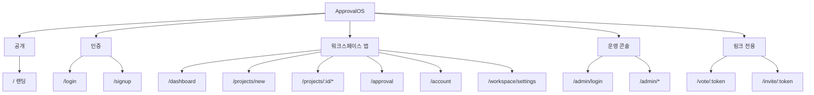
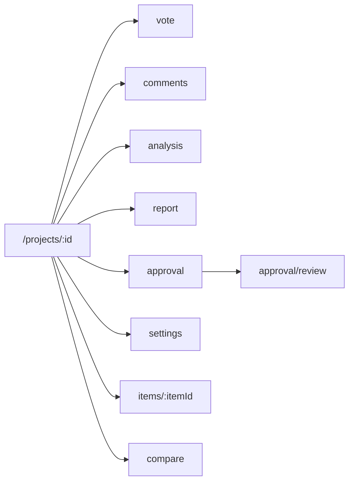
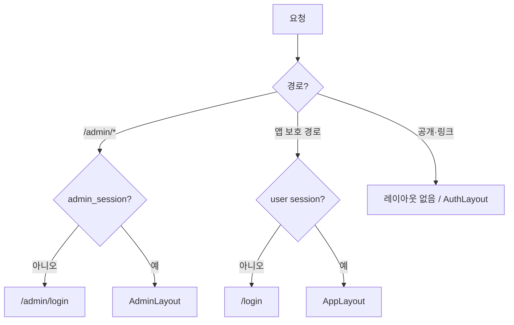

# ApprovalOS — IA 구조도

- 작성일: 2026-07-22
- 기준 코드: `src/App.tsx`, `AppLayout` / `ProjectLayout` / `AdminLayout`
- 범위: **현재 구현된 화면·라우트** (로컬 데모 기준)

---

## 1. 전체 개요

제품은 **3개 진입 영역**으로 나뉜다.

| 영역 | 세션 | 레이아웃 | 목적 |
|------|------|----------|------|
| **공개 / 마케팅** | 없음 | 단독 | 랜딩·가입 유도 |
| **워크스페이스 앱** | `users` (일반 로그인) | `AppLayout` (+ 프로젝트 탭) | 프로젝트·투표·승인·설정 |
| **플랫폼 운영 콘솔** | `admin_users` (운영 로그인) | `AdminLayout` | WS/유저/플랜/공지 운영 |

> WS `users.role = admin` 과 운영 `admin_users` 는 **별도 계층**이다.



---

## 2. 사이트맵 (트리)

```
ApprovalOS
├── /                          랜딩 (마케팅)
├── /login                     로그인
├── /signup                    회원가입 (?invite= 지원)
├── /vote/:token               공개 투표 (비로그인)
├── /invite/:token             초대 수락 (WS / 이메일 초대)
│
├── [AppLayout · 로그인 필요]
│   ├── /dashboard             WS 대시보드 (프로젝트 목록)
│   ├── /projects/new          프로젝트 생성
│   ├── /workspace/settings    멤버 · WS 설정 (WS admin)
│   ├── /approval              승인 센터 (approver / WS admin)
│   ├── /account               계정 · 알림 설정
│   └── /projects/:id          프로젝트
│       ├── (메인)             아이템 그리드
│       ├── /vote              투표
│       ├── /comments          댓글
│       ├── /analysis          AI 분석
│       ├── /report            보고서
│       ├── /approval          승인 라인 설정/현황
│       ├── /approval/review   승인 검토
│       ├── /settings          프로젝트 설정
│       ├── /items/:itemId     아이템 상세
│       └── /compare           비교 모드 (풀스크린, AppLayout 밖)
│
└── [AdminLayout · 운영 세션]
    ├── /admin/login
    ├── /admin/dashboard
    ├── /admin/workspaces
    │   └── /:id
    ├── /admin/users
    │   └── /:id
    ├── /admin/plans
    ├── /admin/notices
    │   ├── /new
    │   └── /:id
    ├── /admin/incidents
    └── /admin/logs
```

---

## 3. 영역별 상세

### 3.1 공개 · 인증 · 링크

| 경로 | 화면 | 비고 |
|------|------|------|
| `/` | 랜딩 | 플랜 소개·CTA |
| `/login` | 로그인 | 개발자 원클릭 로그인 |
| `/signup` | 가입 | `?invite=` 시 가입 후 초대 반영 |
| `/vote/:token` | 공개 투표 | `visibility=link` 프로젝트 |
| `/invite/:token` | 초대 수락 | WS `invite_token` 또는 `invitations.token` |

### 3.2 워크스페이스 앱 (사이드바)

| 메뉴 | 경로 | 노출 조건 |
|------|------|-----------|
| 대시보드 | `/dashboard` | 전원 |
| 새 프로젝트 | `/projects/new` | 전원 |
| 멤버 · 설정 | `/workspace/settings` | 전원 (편집은 WS admin) |
| 승인 센터 | `/approval` | `approver` 또는 WS `admin` |
| 계정 설정 | `/account` | 전원 |

부가 UI: 알림 벨, 플랜 잔여 프로젝트, 공지/점검 **상단 배너**.

### 3.3 프로젝트 내부 탭

`ProjectLayout` 기준 (`/projects/:id` 하위).

| 탭 | 경로 | 역할 |
|----|------|------|
| (메인) | `/projects/:id` | 디자인 아이템 목록 |
| 투표 | `.../vote` | 투표 설정·현황 |
| 댓글 | `.../comments` | 댓글·이미지 첨부 |
| 분석 | `.../analysis` | AI 분석 결과 |
| 보고서 | `.../report` | 검토 보고서 |
| 승인 | `.../approval` | 승인선·상태 |
| 설정 | `.../settings` | 기간·공개·마감 등 |

프로젝트 부가 화면 (탭 외):

| 경로 | 화면 |
|------|------|
| `.../approval/review` | 승인자 검토 액션 |
| `.../items/:itemId` | 아이템·버전·핀 |
| `.../compare` | 비교 모드 (독립 레이아웃) |



### 3.4 운영 콘솔

| 메뉴 | 경로 | 역할 |
|------|------|------|
| 로그인 | `/admin/login` | `ops@approvalos.local` 등 |
| 대시보드 | `/admin/dashboard` | 집계·점검 모드 |
| 워크스페이스 | `/admin/workspaces` | 목록·상세·플랜·정지 |
| 사용자 | `/admin/users` | 정지·탈퇴·비번 stub |
| 플랜 | `/admin/plans` | Free/Pro/Ent 한도 |
| 공지 | `/admin/notices` | CRUD·배너 발행 |
| 점검 | `/admin/incidents` | 인시던트 상태 |
| 운영 로그 | `/admin/logs` | 운영자 액션 로그 |

---

## 4. 접근·세션 규칙



| 규칙 | 내용 |
|------|------|
| 앱 보호 | `Protected` — `session_user_id` 없으면 `/login` |
| 운영 보호 | `AdminProtected` — `admin_session_id` 없으면 `/admin/login` |
| 계정 정지 | `users.status = suspended` 시 앱 로그인 거부 |
| WS 정지 | `workspaces.status = suspended` 시 소속 유저 로그인 거부 |
| 역할 | 프로젝트/승인 UI는 `users.role` (admin/reviewer/approver/viewer) |
| 폴백 | 미매칭 `*` → `/` |

---

## 5. 주요 사용자 여정 (요약)

| 여정 | 흐름 |
|------|------|
| 신규 팀 | `/` → `/signup` → `/dashboard` → `/projects/new` |
| 초대 가입 | `/invite/:token` 또는 `/signup?invite=` → WS 소속 |
| 투표 참여 | 링크 `/vote/:token` 또는 앱 `.../vote` |
| 승인 | `/approval` 또는 `.../approval/review` |
| 운영 | `/admin/login` → WS/유저 제어 → 앱 배너 반영 |

---

## 6. 레이아웃 매핑

| 레이아웃 | 적용 경로 |
|----------|-----------|
| 단독 | `/`, `/vote/:token`, `/invite/:token`, `/admin/login`, `/projects/:id/compare` |
| `AuthLayout` | `/login`, `/signup` |
| `AppLayout` | `/dashboard`, `/projects/*`(compare 제외), `/approval`, `/account`, `/workspace/settings` |
| `AdminLayout` | `/admin/*` (login 제외) |

---

## 7. 관련 문서

- [운영관리자 보완계획](./2026-07-21-운영관리자-보완계획.md)
- [알림·멤버초대 보완계획](./2026-07-21-알림멤버초대-보완계획.md)
- [DB명세서](./2026-07-20-DB명세서.md)

---

*ApprovalOS IA 구조도 | 2026-07-22*
